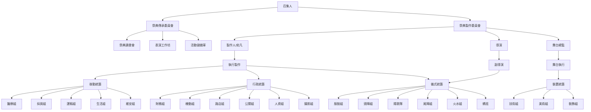

**會議目的**：如何讓下次舉辦活動更好？

---

**決議（下次）**

- 至少提早四個月辦
- 先決定路線，再找店家
- 選出執行統籌，規劃人力統籌
- 擴大火組、醫療組、採買組、運輸組、財務組
- 加強橫向溝通
- 增加裝置與表演互動性
- 好好吃飯
- 訂立工作公約（意見轉達機制）

---

**裝置組回饋**

逸軒：
- 裝置美學碰上衝突需更多溝通時間；裝置組成員希望能更多參與活動規劃。
- 應讓裝置組與儀式組加強討論，橫向溝通的開會時間應明確化。
- 只推燈很無趣，可融入表演形式；推燈需求42人，建議輪替。
- 不知道火的規劃，導致裝置破壞。

Zepher：
- 裝置大小要控制；若無法縮減規模，考量另尋場地施作。
- 活動當天推燈者沒事先協調，人力吃緊，裝置有多處損壞。

阿松：
- 裝置製作需30坪以上倉儲空間。
- 花燈車設計時，技術人員應提早加入；當天開燈時間資訊混亂。
- 圖應儘早確定；需要定期跨組橫向溝通。

**儀式組回饋**

小ㄈ：
- 各組決策者應有明確組織概念；副導演應保留執場指揮角色。
- 火組不應臨時招募，應事先拉入籌備。
- 角色移動（女糸坐車）雖事前確認，但跨組溝通不足。

芷妘：
- 機動組配置、採購組分工需明確化；醫療組受到忽視。

**活動組回饋**

文婷：
- 報名者許多人未到，造成推燈人力短缺。

奕凡：
- 點燈時機完全未被討論；拜拜臨時改為觀看式儀式。
- 女糸移動溝通不足。

采霖：
- 運輸組人力不足，後期差點出車禍；物資配置需提早交代。
- 水組與轎班在山海宮的溝通斷裂，無人領頭。

**宣傳組回饋**

庭誼：
- 宣傳（公關）組被大部分忽略，當天無 Call 機。
- 跨組資訊流通不足；對外說明不夠清晰。

---

**提案組織架構圖**

